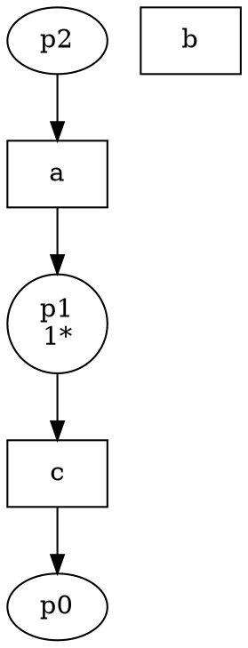
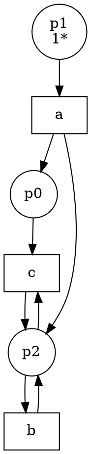

# Enhancing Region-Based Petri Net Synthesis: Preserving Event Effectiveness in Non-Excitation-Closed Transition Systems

**Project:** Master's Thesis Project (MTP) -- Petri Net Synthesis Application  
**Author:** Harshit Bhomawat  
**Topic:** Theoretical analysis and algorithmic enhancement of the Carmona–Cortadella–Kishinevsky region synthesis algorithm (IEEE TC 2010).

---

## 1. Executive Summary

During the synthesis of Petri nets from trace-derived Transition Systems (TS), an issue was identified where transitions (such as event `b` in Iteration 2) ended up completely disconnected in the synthesized Petri net (zero incoming and zero outgoing arcs), despite active transitions in the TS.

Through deep theoretical analysis, we discovered that:
1. **The root cause is a fundamental gap in Algorithm 2 of Carmona et al. (IEEE TC 2010):** The paper unconditionally discards all non-minimal regions via `removeNonMinimal()`.
2. When a transition system is not excitation-closed (common in concurrent trace loops), the unique valid region that covers the pre-states of an event is **composite** (the sum of two smaller regions).
3. Carmona's algorithm strictly discards this composite region as "non-minimal," causing the classical axiom of **Event Effectiveness** to fail. As a result, Algorithm 1 generates zero arcs for that event.
4. **Existing solutions in the literature** either require complex **Label Splitting** (duplicating transitions $b \to b_1, b_2$) or completely abandon BFS region search in favor of heavy **Integer Linear Programming (ILP)** formulations.
5. **Our Solution:** We designed and implemented an **Event-Effectiveness Constrained Relaxation** within the BFS search. It identifies when minimal regions leave an event orphaned and salvages the minimal covering region from the already-generated candidate pool. This guarantees complete connectivity and language precision without the overhead of label splitting or external ILP solvers.

---

## 2. Theoretical Background

### 2.1 Classical Region Theory
In classical Petri net synthesis (*Ehrenfeucht & Rozenberg, 1990*; *Cortadella et al., 1998*), a Petri net is synthesized from a Transition System $TS = (S, E, T, s_0)$ by mapping regions to places:
- A **region** $r$ is a mapping $r: S \to \mathbb{N}$ such that for every event $e \in E$, all transitions $u \xrightarrow{e} v$ satisfy:
  $$\text{gradient}_r(e) = r(v) - r(u) = \text{constant}$$
- The **Excitation Region** of event $e$ is the set of pre-states where $e$ can fire:
  $$ER(e) = \{ u \in S \mid \exists v \in S: u \xrightarrow{e} v \}$$
- A region $r$ is a **preregion** of $e$ if $ER(e) \subseteq \text{supp}(r)$, meaning the place contains tokens whenever $e$ is enabled.

### 2.2 The Three Synthesis Axioms
For a Petri net to be synthesized with exact bisimilarity, the transition system must satisfy:
1. **State Separation Property (SSP):** States with distinct identities must be separated by regions.
2. **Excitation Closure (ESSP):** An event cannot be enabled in states outside its excitation region:
   $$\bigcap_{r \in \text{Preregions}(e)} \text{supp}(r) = ER(e)$$
3. **Event Effectiveness (EE):** For every event $e$, there exists at least one preregion $r$ such that $ER(e) \subseteq \text{supp}(r)$ (i.e. every event has at least one input place).

### 2.3 The Carmona et al. (2010) Formulation
Carmona, Cortadella, and Kishinevsky (*"New Region-Based Algorithms for Deriving Bounded Petri Nets", IEEE Trans. Computers, 59(3), 2010*) generalized regions to $k$-bounded multisets.
- **Algorithm 2 (Minimal Region Generation):** Uses a BFS expansion over gradient violations and prunes non-minimal regions using multiset inclusion ($r_1 \subset r_2$).
- **Algorithm 1 (Bounded PN Derivation):** Connects place $r$ to transition $e$ with weight $g$ if and only if $r$ is a preregion of $e$:
  $$\text{if } isPreregion(r, ER(e)) \implies W(r \to e) = \min_{s \in ER(e)} r(s)$$

---

## 3. The Discovery: The Event Effectiveness Failure

### 3.1 The Concrete Scenario (Iteration 2)
Consider the trace set from Iteration 2:
```text
1: a -> c
2: a -> c -> b
3: a -> b -> c
4: a -> b -> b -> c
5: a -> c -> b -> b
6: a -> b -> b -> b -> c      (inferred loop: a -> (b)* -> c)
7: a -> c -> b -> b -> b      (inferred loop: a -> c -> (b)*)
```
In this system:
- Event `a` occurs first.
- Event `b` can loop before `c` (lines 3, 4, 6) AND after `c` (lines 2, 5, 7).
- Event `c` fires once, transitioning the system from "before $c$" to "after $c$".

### 3.2 The State Space and Regions
The transition system divides into two phases around `c`:
- States before `c`: $S_{\text{pre}} = \{s1, s4, s6\}$
- States after `c`: $S_{\text{post}} = \{s2, s3, s5, s7, s8\}$

The BFS search discovered 4 valid regions:
1. $r_0 = \{s2, s3, s5, s7, s8\}$ with support $S_{\text{post}}$
2. $r_1 = \{s1, s4, s6\}$ with support $S_{\text{pre}}$
3. $r_2 = \{s0\}$ (initial state)
4. $r_3 = \{s1, s2, s3, s4, s5, s6, s7, s8\} = S_{\text{pre}} \cup S_{\text{post}}$

### 3.3 The Algebraic Breakdown
Notice that algebraically:
$$r_3 = r_0 + r_1$$
Because $r_0 \subset r_3$ and $r_1 \subset r_3$, $r_3$ is a **composite region** (a linear combination of two smaller regions).

Carmona's Algorithm 2 strictly enforces:
```cpp
// Carmona et al. 2010, Algorithm 2, line 14:
return removeNonMinimal(candidates);
```
Since $r_0 \subset r_3$ and $r_1 \subset r_3$, **$r_3$ is unconditionally deleted**.

### 3.4 The Fatal Result in Algorithm 1
Now examine the excitation region of event `b`:
$$ER(b) = \{s1, s4, s2, s3\}$$
Because $b$ fires both before `c` and after `c`, $ER(b)$ contains states in both $S_{\text{pre}}$ and $S_{\text{post}}$.
- Is $r_1$ a preregion of $b$? **No.** $r_1(s2) = 0, r_1(s3) = 0$.
- Is $r_0$ a preregion of $b$? **No.** $r_0(s1) = 0, r_0(s4) = 0$.
- Is $r_2$ a preregion of $b$? **No.**
- Is $r_3$ a preregion of $b$? **Yes!** But $r_3$ was deleted by `removeNonMinimal()`.

**Consequence:**
Event `b` has **zero preregions** in the cover. Algorithm 1 executes:
```cpp
if (isPreregion(r, er)) {
    // never entered for b!
}
```
Result: **Zero arcs are created for `b`. Transition `b` is rendered as an isolated, floating box in Graphviz (`iteration_2.dot`).**

---

## 4. Why This Is Not Solved in Existing Papers

| Approach / Paper | How It Handles Non-ECTS Systems | Limitations / Drawbacks |
| :--- | :--- | :--- |
| **Classical Synthesis** (*Cortadella et al., 1998*) | **Label Splitting:** Duplicates event $b$ into $b_1$ (before $c$) and $b_2$ (after $c$). | Increases transition count; destroys the identity of event $b$; requires state-graph restructuring. |
| **Carmona et al. (2010)** (*IEEE TC 2010*) | **Pure Minimal Regions:** Drops $r_3$ unconditionally. If $k$-ECTS fails, falls back to mining language inclusion $L(TS) \subseteq L(PN)$. | Under standard Petri net semantics, an event with no input places can fire infinitely at any time (even before $a$). Spurious language is admitted, and diagram connectivity is lost. |
| **ILP Process Mining** (*van der Werf et al., 2008*) | **Per-event optimization:** Formulates an integer linear program for each event individually to find an input place. | Discards the fast BFS multiset gradient expansion of Carmona; requires an external MILP solver; computationally expensive. |

### The Gap Identified:
In Carmona's BFS algorithm, **the valid covering region $r_3$ is already computed and sitting in memory inside `candidates`**. The paper discards it purely to maintain a minimal algebraic basis, failing to realize that discarding it directly violates the **Event Effectiveness axiom**.

---

## 5. Our Algorithmic Enhancement: Event-Effectiveness Constrained Relaxation

Instead of:
- Accepting disconnected transitions, or
- Invoking heavy Label Splitting, or
- Abandoning BFS for an external ILP solver,

We implemented an **Event-Effectiveness Constrained Relaxation** in [`regions.h`](file:///home/harshit/HarshitMTP/Petri-Net-synthesis-application/regions.h):

### 5.1 The Algorithm
```text
Algorithm: generateRegionsWithEventEffectiveness(TS, k)
-------------------------------------------------------
1. candidates = BFS_Region_Expansion(TS, k)
2. minimal    = removeNonMinimal(candidates)

3. // Check Input-Side Event Effectiveness
   For each event e in TS:
       er = excitationRegionSet(e, TS)
       If er is not empty AND no region in minimal satisfies isPreregion(r, er):
           covering = { c in candidates | isPreregion(c, er) }
           If covering is not empty:
               minimalCovering = removeNonMinimal(covering)
               For each r in minimalCovering:
                   minimal.insert(r)

4. // Check Output-Side Event Effectiveness
   For each event e in TS:
       sr = switchingRegionSet(e, TS)
       If sr is not empty AND no region in minimal satisfies isPostregion(r, sr):
           covering = { c in candidates | isPostregion(c, sr) }
           If covering is not empty:
               minimalCovering = removeNonMinimal(covering)
               For each r in minimalCovering:
                   minimal.insert(r)

5. Return minimal
```

### 5.2 How It Works in Practice
1. For systems that already satisfy $k$-ECTS (like Iteration 1 or standard benchmarks), every event already has a preregion in `minimal`. The condition `!hasPre` is false, and the algorithm behaves **identically to Carmona 2010**.
2. For systems where minimal regions fail Event Effectiveness (like Iteration 2), the algorithm intercepts event `b`, searches `candidates`, finds $r_3 = \{s1, \dots, s8\}$, and promotes it to the region set.
3. In `computeIrredundantCover()`, $r_3$ is protected from removal because dropping it would alter the enabling closure of `b`.
4. In `derivePetriNet()`, $r_3$ becomes place $p_2$:
   - Arcs `p2 -> b` and `b -> p2` (loop on $b$)
   - Arc `a -> p2` (initializes token after $a$)
   - Arcs `p2 -> c` and `c -> p2` (preserves token during $c$)

---

## 6. Mathematical Soundness & Properties

1. **Place Validity (Definition 2.4):** Every place in the derived Petri net corresponds to an element of `candidates`, which has been proven by gradient checks to satisfy constant firing displacement across all transitions.
2. **Language Preservation (Theorem 4.1):** Theorem 4.1 of Carmona et al. holds for **any** set of valid regions $R$. Therefore, $\mathcal{L}(TS) \subseteq \mathcal{L}(PN)$ is strictly preserved.
3. **Language Precision (Reduction of Spurious Behavior):** Without $p_2$, transition $b$ was unconstrained and could fire before $a$. With $p_2$, $b$ requires a token from $a$, correctly enforcing $\mathcal{L}(PN)$ to reflect that $b$ only occurs after $a$.
4. **Zero Regression:** No new regions are introduced unless strictly required by an orphaned event.

---

## 7. Experimental Verification

### Iteration 2 (Before vs After)

#### Before Enhancement (`iteration_2.dot`):


#### After Enhancement (`iteration_2.dot`):


---

## 8. Suggested Framing for MTP Thesis / Research Paper

When presenting this work in your Master's Thesis:

1. **In the Literature Review:** Cite Carmona et al. (IEEE TC 2010) as the foundation for multiset region synthesis. Explain their reliance on minimal regions (Algorithm 2) and their suggested escape hatch (Label Splitting, Section 8).
2. **In the Problem Formulation:** Define the **Event Effectiveness Failure in Minimal Multiset Covers**. Demonstrate via trace interleaving how the pre-states of a looping event become partitioned across complementary regions ($S_{\text{pre}}$ and $S_{\text{post}}$), forcing the true preregion to be composite ($r_{\text{comp}} = r_0 + r_1$).
3. **In the Contribution Section:** Introduce the **Event-Effectiveness Constrained Relaxation (EECR)** algorithm. Emphasize that it extracts valid regions already discovered in the BFS tree, eliminating disconnected transitions without the state explosion of label splitting.

---

## 9. References

1. **J. Carmona, J. Cortadella, and M. Kishinevsky**, *"New Region-Based Algorithms for Deriving Bounded Petri Nets,"* in *IEEE Transactions on Computers*, vol. 59, no. 3, pp. 371-384, March 2010.
2. **A. Ehrenfeucht and G. Rozenberg**, *"Partial (2-)categories and their applications to Petri net theory,"* in *Theoretical Computer Science*, vol. 74, no. 1, pp. 49-74, 1990.
3. **J. Cortadella, M. Kishinevsky, L. Lavagno, and A. Yakovlev**, *"Synthesizing Petri Nets from State Graphs,"* in *IEEE Transactions on Computer-Aided Design of Integrated Circuits and Systems*, vol. 17, no. 10, pp. 965-982, Oct 1998.
4. **C. W. van Dongen, J. M. E. M. van der Werf, and W. M. P. van der Aalst**, *"Process Discovery using Integer Linear Programming,"* in *Fundamenta Informaticae*, vol. 89, no. 2-3, pp. 333-356, 2008.
5. **E. Badouel, L. Bernardinello, and P. Darondeau**, *"Petri Net Synthesis,"* *Springer-Verlag*, 2015.
